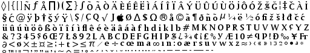

FontGen
=======

A simple utility application that takes a TTF file and converts it
into a .pgm along with a text file describing which character maps to
which coordinates.

Arguments
---------

* `TTFFILE`: filename of the .ttf (or any other format supported by freetype)

* `SIZE`: size of the font (in pixel?!)

* `BORDER`: an border that is left around each glyph, useful when one
wants to add effects such as shadow or a black border

* `IMAGEWIDTH`: width of the resulting image

* `IMAGEHEIGHT`: height of the temporary image (ugly, but needed at the moment)

* `UNICODES`: optional list of characters that shall be generated, default is the whole font

Example
-------

Running:

    build/fontgen generate AMRIGOM.TTF  16 2 512 512 "$(build/fontgen listchars AMRIGOM.TTF)"

Will produce a file `/tmp/out.pgm`:

And a font description `/tmp/out.font`:

    (pingus-font
      (size 16)
      (glyph-count 257)
      (glyphs
        (glyph (unicode 9674) (offset 0 -13) (advance 8) (rect 0 0 12 21)) ;; ◊
        (glyph (unicode 124) (offset 3 -12) (advance 8) (rect 12 0 17 20)) ;; |
        (glyph (unicode 123) (offset 2 -12) (advance 8) (rect 17 0 26 19)) ;; {
        (glyph (unicode 91) (offset 1 -11) (advance 4) (rect 26 0 32 19)) ;; [
        (glyph (unicode 93) (offset 1 -11) (advance 4) (rect 32 0 38 19)) ;; ]
        (glyph (unicode 209) (offset 0 -15) (advance 10) (rect 38 0 52 19)) ;; Ñ
        (glyph (unicode 402) (offset -1 -11) (advance 8) (rect 52 0 65 19)) ;; ƒ
        ....
